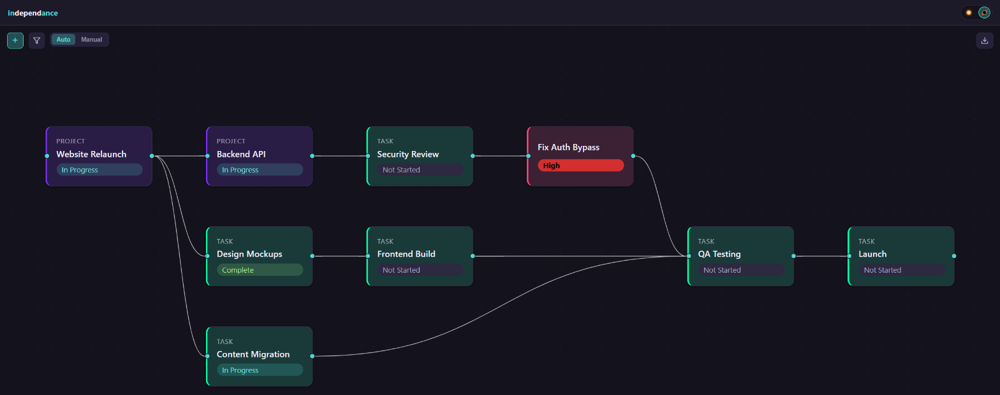

# independance

A visual dependency map for projects, tasks, and POA&Ms. Add your work as tiles, link them with "blocks" / "depends on" relationships, and the graph arranges itself into a clean, readable map — no manual layout required.



## What it does

- **Map dependencies visually.** Create Projects, Tasks, POA&Ms — or your own custom types — and connect them to show what blocks what.
- **Auto-arranging layout.** Add or rewire a dependency and the graph re-lays itself out to stay readable; switch to manual mode any time to position tiles by hand.
- **Edit in place.** Click a tile to expand and edit it, drag one tile onto another to link them, filter the map by type or POA&M severity.
- **Local and private.** No account, no cloud — everything is served from your own machine and stored in a local SQLite file.

## Quick start

Requires Node.js 22+.

```
npm install
npm run dev
```

Then open http://localhost:5173.

## Stack

React + Vite + TypeScript on the client (React Flow for the canvas, Zustand for state), Express + TypeScript on the server, persisted locally via Node's built-in [`node:sqlite`](https://nodejs.org/api/sqlite.html). Shared types and validation live in a `shared` workspace package used by both.
