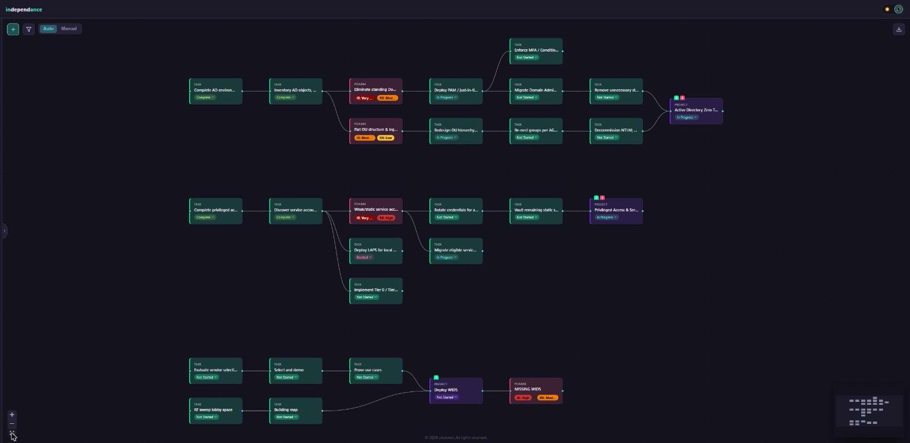
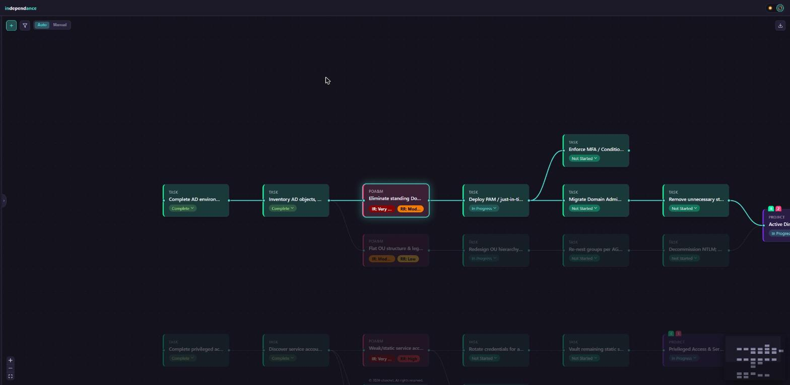
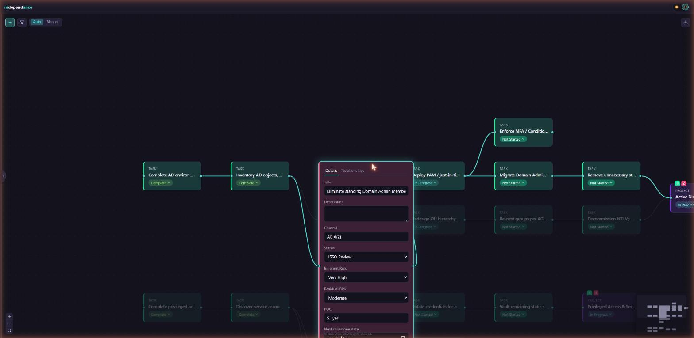

# independance

A visual dependency map for projects, tasks, and POA&Ms. Add your work as tiles, link them with "blocks" / "is blocked by" relationships, and the graph arranges itself into a clean, readable map — no manual layout required.

## Primary features

**Auto-arranging layout.** Tiles are grouped by connected dependency chains and laid out automatically. Or you can manually lay out your dependency map.



**Dependency-chain highlighting.** Select any tile to spotlight its full dependency chain — every ancestor and descendant it's actually connected to — while the rest of the board dims out of the way.



**Rich in-place editing.** Click to expand and edit any tile.



## Minor features

- Manual placement mode — drag tiles to snap to a grid
- Drag one tile onto another to link them
- Multi-select and move a group of tiles together (Shift + click and drag)
- Filter by any field or issue type
- Hover a tile or connection for quick-add buttons to insert new work right into a chain
- Dependency rollup counts on Project tiles (how many tasks/POA&Ms sit downstream)
- Undo/redo (ctrl+z / ctrl+y)
- Customizable tile fields, types, and statuses via Settings
- Light and dark themes
- Fully local and private — no account, no cloud, just a local SQLite file

## Quick start

Requires Node.js 22+.

```
npm install
npm run dev
```

Then open http://localhost:5173.

## Stack

React + Vite + TypeScript on the client (React Flow for the canvas, Zustand for state), Express + TypeScript on the server, persisted locally via Node's built-in [`node:sqlite`](https://nodejs.org/api/sqlite.html). Shared types and validation live in a `shared` workspace package used by both.
